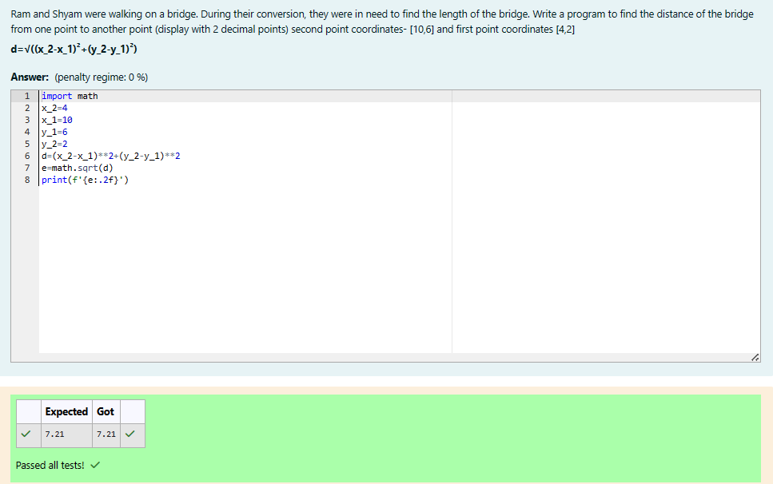

# DISTANCE-BETWEEN-TWO-POINTS

## AIM:
To write a python program to find the distance two 2 points

## ALGORITHM:
### Step 1:
Using import math function,do the calculations.

### Step 2:
Take the two coordinates as l1 and l2.

### Step 3:
formula Substitute the values in the distance formula

### Step 4:
using the print function, display the distance between the two points.

### Step 5:
End the program.

## PROGRAM:
### Program Developed by : HAREVASU S
### Register No. : 212223230069
### Program to find the distance two 2 points
```
import math
x_2=4
x_1=10
y_1=6
y_2=2
d=(x_2-x_1)**2+(y_2-y_1)**2
e=math.sqrt(d)
print(f'{e:.2f}')
```

## OUTPUT:



## RESULT:
Thus the distance of the two points is sucessfully executed and displayed .
